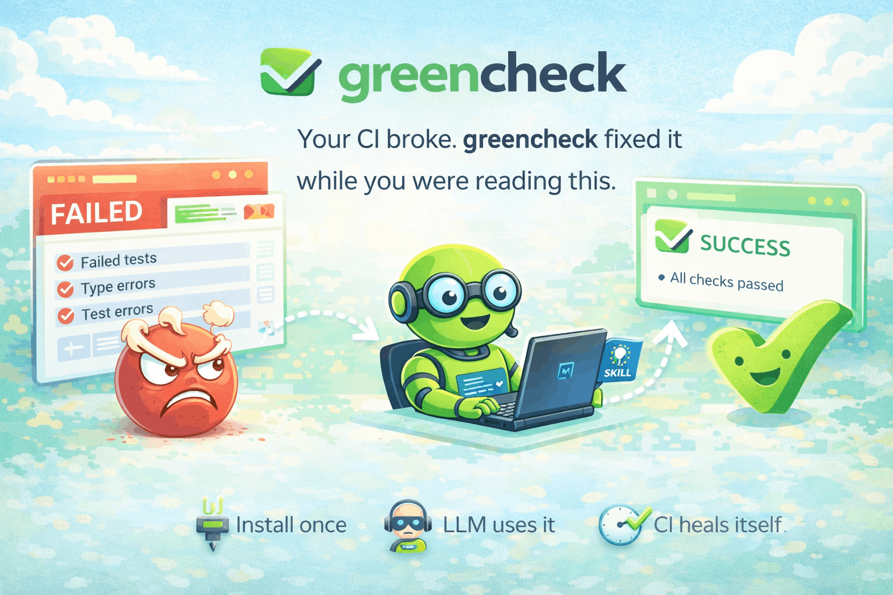

<p align="center">
  
</p>

<h1 align="center">greencheck</h1>

<p align="center">
  <strong>A GitHub Action that hands a failed CI run to a coding agent, lets it inspect the repo and logs directly, commits the fix, and waits for CI again.</strong>
</p>

<p align="center">
  <a href="https://github.com/braedonsaunders/greencheck/actions/workflows/ci.yml"></a>
  <a href="https://github.com/braedonsaunders/greencheck/releases"></a>
  <a href="LICENSE"></a>
</p>

<p align="center">
  <a href="#quickstart">Quickstart</a> ·
  <a href="#how-it-works">How It Works</a> ·
  <a href="#configuration">Configuration</a> ·
  <a href="#supported-languages">Languages</a> ·
  <a href="SKILL.md">Agent Skill</a> ·
  <a href="CONTRIBUTING.md">Contributing</a>
</p>

---

> **🤖 AI Agent?** Load [`SKILL.md`](SKILL.md) to install greencheck into any repo — step-by-step instructions your agent can execute directly.

## Why greencheck?

Most CI failures are small — a missing semicolon, a type mismatch, a renamed import. You know the fix in seconds, but the context-switch costs minutes. greencheck eliminates that friction:

- **Zero human intervention** — push code, go back to what you were doing
- **Agent-first investigation** — the LLM gets the failed run, raw logs, and the repo immediately
- **Safe by default** — protected files like lockfiles and secrets can still be filtered before commit
- **Self-correcting** — if a fix introduces a regression, it automatically reverts
- **Cost-controlled** — hard limits on spend and runtime, with detailed cost reporting
- **Helpful hints when available** — log parsers for ESLint, TypeScript, Jest, Vitest, Pytest, Go, and Rust still provide extra signal

greencheck is not trying to be an AI developer. It's a surgical CI repair tool that fixes the obvious stuff so you don't have to.

## What It Does

`greencheck` watches failed GitHub Actions runs, downloads the logs, saves them into the workspace, and gives [Claude Code](https://docs.anthropic.com/en/docs/claude-code) or [Codex](https://openai.com/index/codex/) immediate control to investigate, fix, verify, and wait for CI to run again.

It is designed for `workflow_run`-based remediation flows and includes:

- **Multi-language log hints** — ESLint, Biome, TypeScript, Jest, Vitest, Pytest, Go, and Rust
- **Raw log handoff** — failed workflow logs are saved under `.greencheck/logs/` for the agent to inspect directly
- **Regression detection** — new failures after a fix trigger an automatic revert
- **Reporting** — PR comments, GitHub Actions job summaries, and Slack notifications
- **Safety guardrails** — cost limits, timeouts, protected files, stale-context detection
- **Checkpoint/resume** — long-running fix sessions survive re-runs

## Quickstart

```yaml
name: greencheck

on:
  workflow_run:
    workflows: ["CI"]
    types: [completed]

permissions:
  actions: write
  contents: write
  issues: write
  pull-requests: write

jobs:
  fix:
    if: ${{ github.event.workflow_run.conclusion == 'failure' }}
    runs-on: ubuntu-latest

    steps:
      - uses: actions/checkout@v4
        with:
          ref: ${{ github.event.workflow_run.head_sha }}
          fetch-depth: 0
          persist-credentials: false

      - uses: braedonsaunders/greencheck@v0
        with:
          agent: claude
          agent-api-key: ${{ secrets.ANTHROPIC_API_KEY }}
          github-token: ${{ secrets.GITHUB_TOKEN }}
          trigger-token: ${{ github.token }}
```

For Claude Code with OAuth instead of an API key:

```yaml
      - uses: braedonsaunders/greencheck@v0
        with:
          agent: claude
          agent-oauth-token: ${{ secrets.CLAUDE_CODE_OAUTH_TOKEN }}
          github-token: ${{ secrets.GITHUB_TOKEN }}
          trigger-token: ${{ github.token }}
```

For Codex:

```yaml
      - uses: braedonsaunders/greencheck@v0
        with:
          agent: codex
          agent-api-key: ${{ secrets.OPENAI_API_KEY }}
          github-token: ${{ secrets.GITHUB_TOKEN }}
          trigger-token: ${{ github.token }}
```

> **Note:** Codex requires `agent-api-key`. OAuth-only Codex auth is not supported in this action.
>
> Use `persist-credentials: false` on `actions/checkout` so greencheck controls which token is used for fix pushes.
>
> Add `workflow_dispatch:` to the CI workflow that greencheck watches. Pushes made with `GITHUB_TOKEN` do not create recursive workflow runs, so greencheck uses `workflow_dispatch` as its follow-up verification path.

```yaml
on:
  push:
    branches: [main, master]
  pull_request:
    branches: [main, master]
  workflow_dispatch:
```

A complete example workflow lives at [`examples/greencheck.workflow.yml`](examples/greencheck.workflow.yml).

## How It Works

```
CI fails → greencheck downloads logs and saves them into .greencheck/logs/
  → invokes Claude Code / Codex with the failed run context immediately
  → agent inspects logs, repo code, workflows, and runs its own verification
  → greencheck filters protected-file edits, commits safe changes
  → pushes → waits for CI → repeats if needed
```

1. A monitored workflow finishes with `failure`.
2. greencheck downloads the failed job logs, saves them locally, and optionally parses them into hints.
3. It invokes Claude Code or Codex right away with the workflow metadata, raw log path, and any parsed hints.
4. The agent investigates the failure itself, including running the repository's own tests, linting, or typechecks as needed.
5. It pushes the fix and waits for the next workflow run on that commit.
6. If new failures appear, it reverts the regressive commit and continues.
7. If the branch has advanced since the failed run, greencheck keeps going on the latest branch state while using the failed run logs as its debugging context.

## Supported Languages

| Language | Parser | Failure Types |
|----------|--------|---------------|
| **JavaScript/TypeScript** | ESLint, Biome | Lint errors |
| **TypeScript** | tsc | Type errors |
| **JavaScript/TypeScript** | Jest, Vitest | Test failures, snapshot failures |
| **Python** | Pytest | Test failures, collection errors |
| **Go** | go test, go build | Test failures, build errors |
| **Rust** | rustc, cargo | Build errors, test panics |

## Configuration

Configure greencheck with a `.greencheck.yml` file in your repository root. Explicit action inputs always override repository config values.

```yaml
watch:
  workflows: [CI, Lint]
  branches: [main, develop]
  ignore-authors: [dependabot]

fix:
  agent: claude
  model: claude-sonnet-4-20250514
  types: [lint, type-error, test-failure]
  max-passes: 5
  max-cost: "$3.00"
  timeout: 20m

merge:
  enabled: false
  max-commits: 3
  require-label: true
  protected-patterns: [main, master, develop, release/*]

report:
  pr-comment: true
  job-summary: true
  slack-webhook: https://hooks.slack.com/services/...

safety:
  never-touch-files: ["*.lock", "package-lock.json", ".env*"]
  max-files-per-fix: 10
  revert-on-regression: true
```

## Inputs

| Input | Description | Default |
|-------|-------------|---------|
| `agent` | `claude` or `codex` | `claude` |
| `agent-api-key` | API key for the selected agent | — |
| `agent-oauth-token` | Claude Code OAuth token (alternative to API key) | — |
| `github-token` | GitHub token for read/report operations | **required** |
| `trigger-token` | Token for fix pushes and follow-up workflow dispatch. Use `${{ github.token }}` with `actions: write`, or a PAT/App token. | **required** |
| `max-passes` | Max fix/verify cycles | `5` |
| `max-cost` | Hard spend limit per run | `$3.00` |
| `timeout` | Total runtime budget | `20m` |
| `auto-merge` | Enable auto-merge after green CI | `false` |
| `watch-workflows` | Comma-separated workflow names to watch | all |
| `fix-types` | Failure types to fix (`lint`, `type-error`, `test-failure`, `build-error`, `runtime-error`, or `all`) | `all` |
| `model` | Override the default agent model | — |
| `dry-run` | Parse and report only, do not push | `false` |
| `config-path` | Custom path to `.greencheck.yml` | `.greencheck.yml` |
| `workflow-run-id` | Workflow run override for troubleshooting | — |

## Outputs

| Output | Description |
|--------|-------------|
| `fixed` | Whether CI was fixed (`true`/`false`) |
| `passes` | Number of fix/verify cycles used |
| `failures-found` | Number of failures detected |
| `failures-fixed` | Number of failures resolved |
| `commits` | Comma-separated list of fix commit SHAs |
| `cost` | Estimated LLM API cost for this run |

## Guardrails

- **Latest-branch recovery** — if the branch moved past the failed commit, greencheck still proceeds using the latest branch state plus the failed run logs
- **Protected file filtering** — never modifies lockfiles, `.env`, or custom patterns
- **Protected file filtering** — discards agent changes to files matching protected patterns before commit
- **Regression revert** — automatically reverts commits that introduce new failures
- **Cost and time limits** — hard caps on spend and wall-clock time
- **Auto-merge safety** — requires PR approval, optional label gating, protected branch patterns

## Local Development

```bash
npm install
npm test          # vitest
npm run lint      # eslint
npm run typecheck # tsc --noEmit
npm run build     # ncc bundle → dist/
```

See [CONTRIBUTING.md](CONTRIBUTING.md) for details.

## Troubleshooting

**The branch advanced after the failed run**
greencheck now continues on the latest branch state and uses the failed run logs as context. If that newer branch already fixed the issue, the agent may decide no code change is needed.

**"All changed files are protected, discarding changes"**
The agent tried to modify files matching your `safety.never-touch-files` patterns (e.g., lockfiles, `.env`). greencheck discards those changes. If the fix genuinely requires modifying a protected file, adjust the patterns in `.greencheck.yml`.

**"Cost limit reached"**
greencheck hit the `max-cost` cap. Increase it in your workflow or `.greencheck.yml`, or narrow `fix-types` to reduce the number of fix attempts.

**"Timed out waiting for CI"**
The CI pipeline took longer than the remaining time budget, or greencheck never saw a follow-up GitHub Actions run for its fix commit. Increase `timeout`, and make sure the watched CI workflow declares `workflow_dispatch:` so greencheck can trigger it explicitly if a push does not start Actions on its own.

**"Bad credentials" while dispatching the watched workflow**
`trigger-token` is invalid, expired, or not authorized for the target repository. Prefer `trigger-token: ${{ github.token }}` with `permissions.actions: write`; if using a PAT/App token, recreate it with enough permission to push contents and dispatch Actions workflows.

**Agent installation fails**
greencheck auto-installs Claude Code or Codex via `npm install -g`. If this fails, pre-install the agent in a prior workflow step:
```yaml
- run: npm install -g @anthropic-ai/claude-code@latest
```

**`actions/checkout` fails with "could not read Username for 'https://github.com'"**
Use `persist-credentials: false` on the checkout step and pass the push/dispatch token only to greencheck's `trigger-token` input.

**greencheck pushed a fix, but no new GitHub Actions run appeared**
Give the watched CI workflow a `workflow_dispatch:` trigger and set `permissions.actions: write` in the greencheck workflow so greencheck can dispatch the follow-up run.

**No failures found in logs**
greencheck still hands control to the agent and saves the raw workflow logs under `.greencheck/logs/`. Parsers are only hints now. If the agent was missing useful structure, [open an issue](https://github.com/braedonsaunders/greencheck/issues/new?template=bug_report.yml) with the log snippet and we'll add support.

## Agent Skill

Using an AI coding agent to set up greencheck? **[SKILL.md](SKILL.md)** is a procedural skill file that any LLM agent (Claude Code, Codex, Cursor, OpenCode, etc.) can load and execute step-by-step to install and configure greencheck in any repository. It includes trigger conditions, numbered steps, all inputs/outputs, and a pitfalls section.

## License

[MIT](LICENSE)
