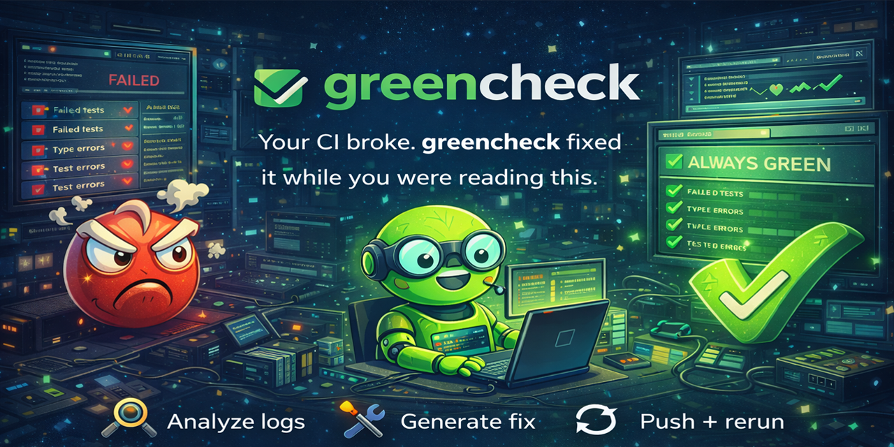

<p align="center">
  
</p>

<h1 align="center">greencheck</h1>

<p align="center">
  <strong>A GitHub Action that reads failed CI logs, asks a coding agent for the smallest fix, commits it, and waits for CI again.</strong>
</p>

<p align="center">
  <a href="#quickstart">Quickstart</a> |
  <a href="#how-it-works">How It Works</a> |
  <a href="#configuration">Configuration</a>
</p>

## Status

This repository now builds cleanly, has passing tests, and ships a generated `dist/` bundle. The current implementation supports:

- `workflow_run` triggers for failed GitHub Actions workflows
- log parsing for ESLint/Biome, TypeScript, Jest/Vitest, Pytest, Go, and Rust output
- Claude Code and Codex CLI invocation
- scoped commits, out-of-scope file filtering, regression reverts, PR comments, and job summaries

It does not currently support `check_suite` or `issue_comment` triggers.

## Quickstart

```yaml
name: greencheck

on:
  workflow_run:
    workflows: ["CI"]
    types: [completed]

permissions:
  actions: read
  contents: write
  issues: write
  pull-requests: write

jobs:
  fix:
    if: ${{ github.event.workflow_run.conclusion == 'failure' }}
    runs-on: ubuntu-latest

    steps:
      - uses: actions/checkout@v4
        with:
          ref: ${{ github.event.workflow_run.head_sha }}
          fetch-depth: 0
          token: ${{ secrets.GREENCHECK_TOKEN }}

      - uses: braedonsaunders/greencheck@v0
        with:
          agent: claude
          agent-api-key: ${{ secrets.ANTHROPIC_API_KEY }}
          github-token: ${{ secrets.GITHUB_TOKEN }}
          trigger-token: ${{ secrets.GREENCHECK_TOKEN }}
```

For Claude Code, you can use OAuth instead of an API key:

```yaml
      - uses: braedonsaunders/greencheck@v0
        with:
          agent: claude
          agent-oauth-token: ${{ secrets.CLAUDE_CODE_OAUTH_TOKEN }}
          github-token: ${{ secrets.GITHUB_TOKEN }}
          trigger-token: ${{ secrets.GREENCHECK_TOKEN }}
```

For Codex in CI, use `agent-api-key`. The current action does not support OAuth-only Codex auth.

## How It Works

1. A monitored workflow finishes with `failure`.
2. `greencheck` downloads the failed job logs and parses them into structured failures.
3. It prioritizes the next fixable cluster and invokes Claude Code or Codex with a narrow prompt.
4. If the agent edits files outside the failure scope, `greencheck` discards those edits and only commits the remaining in-scope changes.
5. It waits for the next workflow run on that commit.
6. If new failures appear, it can revert the regressive commit and continue.

The action also refuses to operate on stale logs. If the branch has advanced since the failed run, it exits instead of patching the wrong commit.

## Configuration

Repository config lives in `.greencheck.yml`. Explicit action inputs override repository config. If an input is omitted, the repo config can supply it.

```yaml
watch:
  workflows: [CI, Lint]
  branches: [main, develop]
  ignore-authors: [dependabot]

fix:
  agent: claude
  model: claude-sonnet-4-20250514
  types: [lint, type-error, test-failure]
  max-passes: 5
  max-cost: "$3.00"
  timeout: 20m

merge:
  enabled: false
  max-commits: 3
  require-label: true
  protected-patterns: [main, master, develop, release/*]

report:
  pr-comment: true
  job-summary: true

safety:
  never-touch-files: ["*.lock", "package-lock.json", ".env*"]
  max-files-per-fix: 10
  revert-on-regression: true
```

## Inputs

| Input | Description |
|---|---|
| `agent` | `claude` or `codex` |
| `agent-api-key` | API key for the selected agent |
| `agent-oauth-token` | Claude Code OAuth token |
| `github-token` | GitHub token for read/report operations |
| `trigger-token` | token used for push and rerun operations |
| `max-passes` | max fix/verify cycles |
| `max-cost` | hard spend limit |
| `timeout` | total runtime budget |
| `auto-merge` | enable auto-merge after green CI |
| `watch-workflows` | comma-separated workflow names to watch |
| `fix-types` | comma-separated failure types or `all` |
| `model` | override agent model |
| `dry-run` | parse and report only, do not push |
| `config-path` | repository config path |
| `workflow-run-id` | optional run id override for local testing |

## Safety Notes

- The action only supports `workflow_run` today.
- It skips stale failure contexts when the branch moved after the failed run.
- It filters out protected files before commit.
- Auto-merge is opt-in and still basic: label + approval + branch guardrails.

## Development

```bash
npm install
npm test
npm run lint
npm run typecheck
npm run build
```

## License

MIT
