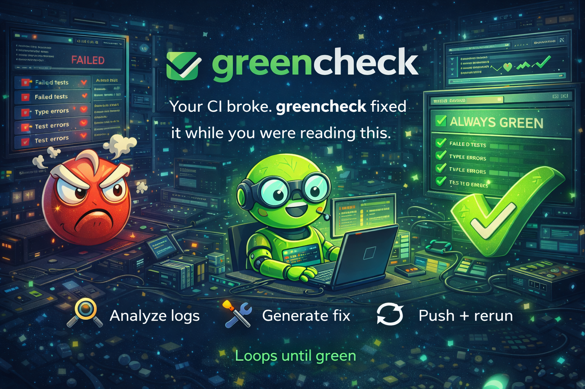

<p align="center">
  
</p>

<h1 align="center">greencheck</h1>

<p align="center">
  <strong>Your CI broke. greencheck fixed it while you were reading this.</strong>
</p>

<p align="center">
  <a href="#quickstart">Quickstart</a> •
  <a href="#how-it-works">How It Works</a> •
  <a href="#configuration">Configuration</a> •
  <a href="./SPEC.md">Full Spec</a>
</p>

<p align="center">
  
  
  
</p>

---

**greencheck** is a GitHub Action that watches your CI pipeline and **autonomously fixes failures** using LLM-powered coding agents. Lint broke? Tests failing? Type errors? greencheck reads the logs, writes the fix, pushes the commit, re-runs CI, and **loops until it's green**.

No suggestions. No PRs to review. It just fixes it.

```
❌ CI failed: ESLint — 3 errors in src/auth.ts
   ↓
🔍 greencheck reads logs, extracts errors
   ↓
🔧 Fixes applied (1 commit)
   ↓
🔄 CI re-triggered...
   ↓
✅ All checks passed. 47 seconds total.
```

---

## Why greencheck?

Every CI failure costs you **30–60 minutes** of context-switching. Multiply that across your team, across every push, every day. That's not engineering — it's janitorial work.

greencheck handles the janitorial work so you can keep building.

| | Other tools | greencheck |
|---|---|---|
| Suggests fixes | ✅ | — |
| Actually pushes fixes | — | ✅ |
| Loops until green | — | ✅ |
| Reads real CI logs | Some | ✅ |
| Auto-merges (opt-in) | — | ✅ |
| Works with your LLM keys | — | ✅ |

---

## Quickstart

```yaml
# .github/workflows/greencheck.yml
name: greencheck
on:
  workflow_run:
    workflows: ["CI"]        # name of your CI workflow
    types: [completed]

jobs:
  fix:
    if: ${{ github.event.workflow_run.conclusion == 'failure' }}
    runs-on: ubuntu-latest
    permissions:
      contents: write
      actions: read
      pull-requests: write
    steps:
      - uses: actions/checkout@v4
        with:
          ref: ${{ github.event.workflow_run.head_branch }}
          token: ${{ secrets.GREENCHECK_TOKEN }}

      - uses: braedonsaunders/greencheck@v0
        with:
          agent: claude                              # or: codex
          agent-api-key: ${{ secrets.ANTHROPIC_API_KEY }}
          github-token: ${{ secrets.GITHUB_TOKEN }}
          trigger-token: ${{ secrets.GREENCHECK_TOKEN }}
```

Or use **OAuth** instead of an API key:

```yaml
      - uses: braedonsaunders/greencheck@v0
        with:
          agent: claude
          agent-oauth-token: ${{ secrets.CLAUDE_CODE_OAUTH_TOKEN }}
          github-token: ${{ secrets.GITHUB_TOKEN }}
          trigger-token: ${{ secrets.GREENCHECK_TOKEN }}
```

That's it. When your CI fails, greencheck wakes up and starts fixing.

---

## How It Works

```
workflow fails
      │
      ▼
┌─────────────┐
│  Read Logs   │ ← Downloads CI output via GitHub API
└──────┬──────┘
       │
       ▼
┌─────────────┐
│   Triage     │ ← Classifies: lint? types? tests? build?
└──────┬──────┘
       │
       ▼
┌─────────────┐
│    Fix       │ ← Deterministic first (lint --fix), then LLM
└──────┬──────┘
       │
       ▼
┌─────────────┐
│ Push + Rerun │ ← Atomic commit, re-trigger CI
└──────┬──────┘
       │
       ▼
  Still red? ──yes──→ loop back to Read Logs
       │
      no
       │
       ▼
     ✅ Done
```

### What it fixes

| Failure Type | Strategy | Risk |
|---|---|---|
| Lint / formatting | Runs `--fix` directly, no LLM needed | Very low |
| Type errors | LLM with type context | Medium |
| Test failures | LLM with test + source code | Medium |
| Snapshot failures | Updates snapshots directly | Low |
| Build / dependency errors | Deterministic + LLM fallback | Low |

### What it won't do

- Touch files outside the PR diff
- Push to main/master directly
- Force-push anything, ever
- Merge without explicit opt-in + label + approved reviews
- Exceed your cost or time limits

---

## Configuration

### `.greencheck.yml`

```yaml
watch:
  workflows: [ci, tests, lint]
  branches: [main, develop]
  ignore-authors: [dependabot]

fix:
  agent: claude                     # or: codex
  model: claude-sonnet-4-20250514
  max-passes: 5
  max-cost: "$3.00"
  timeout: 20m

merge:
  enabled: false
  require-label: true

safety:
  never-touch-files: ["*.lock", ".env*"]
  max-files-per-fix: 10
  revert-on-regression: true
```

### Action Inputs

| Input | Default | Description |
|---|---|---|
| `agent` | `claude` | CLI agent: `claude` or `codex` |
| `agent-api-key` | — | API key (`ANTHROPIC_API_KEY` or `OPENAI_API_KEY`) |
| `agent-oauth-token` | — | OAuth token (alternative to API key) |
| `max-passes` | `5` | Max fix → verify cycles |
| `max-cost` | `$3.00` | Hard spend limit per run |
| `timeout` | `20m` | Wall-clock budget |
| `auto-merge` | `false` | Merge PR after green CI |
| `dry-run` | `false` | Diagnose only, don't push |

---

## Agent Architecture

greencheck doesn't reinvent the wheel. It delegates fixes to the **official CLI agents** — [`claude`](https://github.com/anthropics/claude-code) (Claude Code) and [`codex`](https://github.com/openai/codex) (OpenAI Codex CLI) — which are installed at runtime and invoked via their SDK/CLI interfaces.

This means greencheck inherits their full capabilities: tool use, multi-file edits, test execution, and iterative reasoning. greencheck's job is the **orchestration layer** — log parsing, failure triage, CI re-triggering, and the fix loop. The agents do the actual coding.

### Authentication

Both agents support **API key** and **OAuth** authentication. Use whichever your org prefers.

| Agent | API Key | OAuth Token | CLI Command |
|---|---|---|---|
| Claude Code | `ANTHROPIC_API_KEY` | `CLAUDE_CODE_OAUTH_TOKEN` | `claude` |
| Codex CLI | `OPENAI_API_KEY` | via `codex login` | `codex` |

**API key** is simplest — store it as a repo secret and pass it in. **OAuth** is better for orgs that want to use existing Claude Pro/Max/Team subscriptions or OpenAI org billing without distributing raw API keys.

```yaml
# API key auth
agent-api-key: ${{ secrets.ANTHROPIC_API_KEY }}

# OR OAuth auth
agent-oauth-token: ${{ secrets.CLAUDE_CODE_OAUTH_TOKEN }}
```

### How agents are invoked

greencheck installs the CLI at action startup and invokes it in two modes:

- **SDK mode** (preferred): Streams JSONL events for real-time progress tracking. Supports tool use introspection and structured output parsing.
- **CLI mode** (fallback): Direct process invocation with prompt via temp file. Used when SDK streaming isn't available or errors out.

The agent receives: the parsed failure context, relevant source files, and a focused prompt like *"Fix the ESLint error `no-unused-vars` at src/auth.ts:47. Do not change any other files."* greencheck validates the output, applies the patch, and commits.

You control the model, the cost, and the context window. greencheck is just the orchestrator.

---

## Safety

greencheck is paranoid by default.

- **Atomic commits** — one fix per commit, trivial to revert
- **Regression detection** — if a fix breaks something new, it auto-reverts
- **Cost ceiling** — hard `max-cost` limit, stops immediately when hit
- **Branch protection** — only pushes to feature branches, never main
- **Scope limits** — only touches files that are already in the PR diff
- **Auto-merge is off by default** — requires explicit config + label + approved reviews

---

## Contributing

greencheck is in early development. If you want to help build the CI guardian the world deserves, open an issue or PR.

---

## License

MIT

---

<p align="center">
  <sub>Built by <a href="https://github.com/braedonsaunders">@braedonsaunders</a></sub>
</p>
